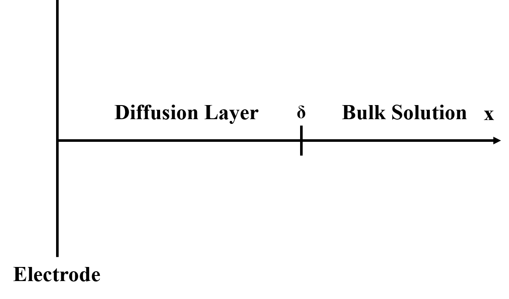
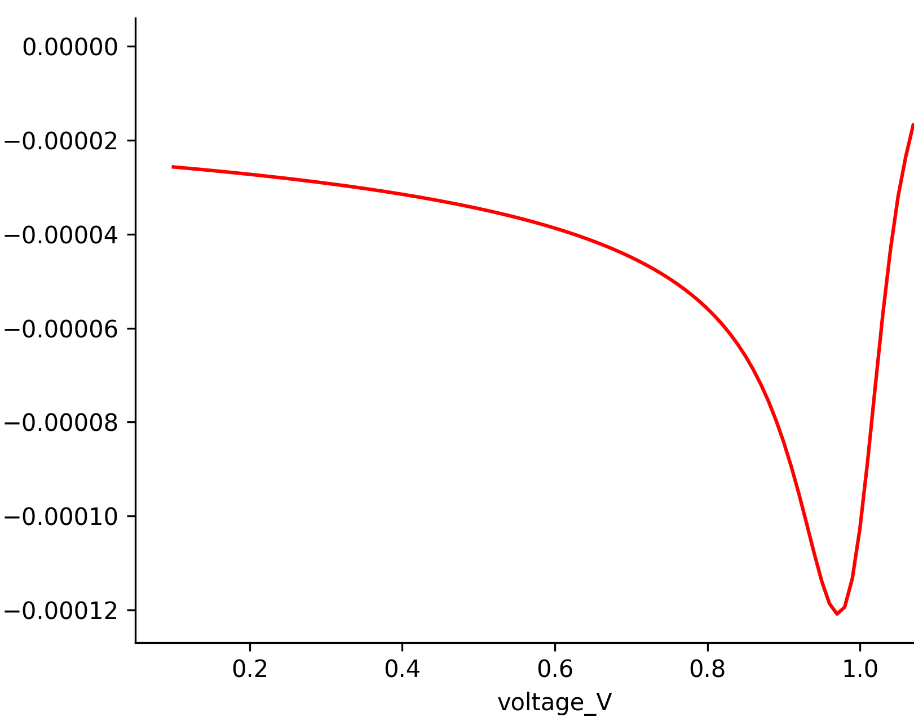

[TOC]

# Preface

Thousands of fresh graduate student start their research in the field of
electrochemistry every year, ranging from the electrocatalyst to the
lithium battery. They may carefully place three electrodes in the
electrolyte and set up the parameters like the initial voltage, cut-off
voltage, and scan rate based on the supervision from their senior lab
mates. They will be excited to see the duck-shaped cyclic voltammograms.
Then they pour out the information like the peak of oxidation and
reduction in a report or a presentation of a group meeting. However,
they may be soon tired of doing the CV again and again. They start to
read the book like *Electrochemical Systems* and try to figure out the
mechanism behind the duck-shaped CVs. Some of them quickly run through
the maze made of equations and arrive at the destination. But most of
the students are frustrated in the maze due to the lack of knowledge of
calculus, numerical solution, or the skills to write the code. They
tried to seek help but received rare responses. Though I am from the
academic tree of John Newman, I have to admit that I was once in the
team of slow movers. Luckily I didn’t give up and slowly walked through
the maze. After getting a Ph.D., I hope to contribute to the community
by sharing my knowledge. I will establish two models in this file, the
model of a single electrode and the model of a whole fuel cell. In the
version 1.0, the single electrode model was described. The model of a
whole fuel cell model will be added in the version 2.0. If I am still
have some times, I’d like to update a lithium battery model in the
version 3.0. But it cannot be guaranteed. I will present the physical
model, mathematical knowledge related to solving the model, and the
source code written by Python. All steps in the derivation will be
included.

# Single electrode model

A reversible reaction, , occurs on the working electrode. A scheme of
working electrode is shown in Figure [fig:scheme of single electrode].

[fig:scheme of single electrode]

Every numerical modeling has their own assumptions. Here, several
assumptions for this modeling have to be introduced. We can assume that
the solution starts with species O initially and has no R. Then the
initial conditions can be written as,

$$C_O(x,0)=C^*_O
\label{eq1}$$

and

$$C_R(x,0)=0
\label{eq2}$$

Another assumption is the semi-infinite boundary conditions. One can
normally assume that at large distances from the electrode, the
concentration reaches to a constant value since the electrolysis cell is
usually large compared to the length of diffusion.

$$\lim_{x\to\infty} C_O(x,t)=C^*_O
\label{eq3}$$

and

$$\lim_{x\to\infty} C_R(x,t)=0
\label{eq4}$$

We need another boundary condition on the electrode surface. It usually
depends on the assumption of the kinetics of the electrochemical
reaction. The general current-potential characteristic like the
Butler-Volmer equation or its special case, Nernst equation, can be
used. To simplify our instruction, I’d like to assume the
electrochemical reaction as the highly reversible one, which is called
the Nernstian electrode process. Its electrode kinetics is so fast that
the electrode potential and the surface concentrations are in local
Nernstian balance at all times regardless of the details of the
mechanism and current flow.

$$E=E^{0'}+\frac{RT}{nF}ln\frac{C_O(0,t)}{C_R(0,t)}
\label{eq5}$$

With those assumptions and boundary conditions, we can start to think
about the electrochemistry model on a single working electrode.

## Chronoamperometry

The first case I’d like to talk about is the chronoamperometry
experiment, which means that the potential was held as a constant for a
long time. The i-E curve and concentration profile will be modeled. A
detailed model and its derivation of cathodic (reduction)
chronoamperometry will be demonstrated.

When the applied potential is lower than the standard reduction
potential, there is a cathodic (reduction) reaction on the working
electrode. If the applied potential is higher than the standard
reduction potential, there is an anodic (oxidation) reaction on the
working electrode. IUPAC defines anodic current as positive while the
cathodic current as negative. Taking cathodic reaction as an example,
the flux of O should transports toward the electrode surface (negative x
direction, negative $N_O$ value) and species R transports away from the
electrode surface to the bulk solution (positive x direction, positive
$N_R$) since O is reduced to R in the cathodic reaction.

$$\frac{i}{A} = N_OnF
    \label{eq6}$$

$$\frac{i}{A} = -N_RnF
    \label{eq7}$$

, where $i$ is the current, $n$ is the stoichiometry of electron in the
reaction, $A$ is the electrode surface contacting with electrolyte, and
$F$ is the Faradic constant equaling to 96485 . Equation [eq6] and [eq7]
reveal the relationship between the current and mass transfer in
electrolyte. The unit of current is ampere () which can be written as .
1 indicates 1 electrons is consumed on the electron in a second. The
Faradic constant points out that 1 mole of electrons contains 96485 C
charges. By the electrochemical reaction formula (), every mole of
consumed/generated electrons corresponds to $\frac{1}{n}$ mole of O and
R respectively. Since the molar flux is the rate of molar flow per unit
area, the current is also converted into current density by dividing an
electrode surface area. Equation [eq6] and [eq7] answer a simple but
important question, how many moles of reactant/product are needed to be
transported to/away the electrode surface in the unit time and area for
the generation of a certain current density? A more significant physical
meaning is that the bridge between the measurable parameter
(current,$i$) and the microparameters ($N_O,N_R$) has been established.

Nernst-Planck equation describes the molar flux in the electrolyte,

$$N_i(x)=-D_i\pdv{C_i}{x}-\frac{z_iF}{RT}D_iC_i\pdv{\phi}{x}+C_iv(x)
\label{eq8}$$

where the molar flux $N_i(x)$ is written as the sum of diffusion,
migration, and convection. In the chronoamperametry test, the voltage is
held as a constant while current changes vs. time. Based on Equation
[eq6] and [eq7], then the molar fluxes of O and R are also expected to
change vs. time. The time-dependent Nernst-Plank equation has to be
introduced.

$$\pdv{C_i}{t}=-\nabla N_i
    \label{eq9}$$

It has to be pointed out that Equation [eq9] is derived from the mass
conservation. In the more general form, a homogeneous reaction rate of
species $i$,$R_i$, should be added to the right side of Equation [eq9].
Most of the electrochemical reactions are heterogeneous reactions which
only happen on the interface of electrode and electrolyte. Then the
$R_i$ is zero. There is one special case. In the homogeneous model of a
porous electrode, the porous electrode like the gas diffusion electrode
(GDE) of fuel cell including the electrolyte inside the pores is viewed
as a homogeneous material. In this case, the reaction on the solid
surface can be viewed as the homogeneous reaction inside the porous
electrode.

Let us go back to Equation [eq8]. There are three terms in the molar
flux, diffusion, migration, and convection. If the solution is not
stirred, the convection is zero. In most of three-electrode
electrochemical experiments, especially with supporting electrolyte
(like sulfuric acid or alkaline solution), the potential difference
($\nabla \phi$) is negligible. So in this case, only diffusion will be
considered for the mass transfer. Then we can rewrite the time-dependent
Nernst-Plank equation, Equation [eq9].

$$\pdv{C_i(x,t)}{t}=D_i\pdv[2]{C_i(x,t)}{x}
    \label{eq10}$$

The boundary conditions for Equation [eq10] are Equation [eq1], [eq2],
[eq3], [eq4], [eq5], [eq6], and [eq7]. The boundary conditions from
Equation [eq5], [eq6], and [eq7] may be a little confused. We will
explain it in the process of derivation.

To solve the time-dependent Equation [eq10], Laplace transform will be
used. It transforms a function of a real variable t (often time) to a
function of a complex variable s (complex frequency). In the application
of solving differential equations, the Laplace transform reduces a
linear differential equation to an algebraic equation, which can then be
solved by the formal rules of algebra.

Next, we’d like to introduce how to use Laplace transform to solve the
differential equation. The basic form of Laplace transformation is,

$$\mathscr{L}\{F(t)\}=\int_{0}^{\infty} e^{-s(t)}F(t) dt$$

where the $\mathscr{L}\{F(t)\}$ can also be written as f(s).

In the transform of partial equations,

$$\mathscr{L}\{\frac{dF(t)}{dt}\}=sf(s)-F(0)
    \label{eq11}$$

The general form is,

$$\mathscr{L}\{F^{(n)}\}=s^nf(s)-s^{n-1}F(0)-s^{n-2}F'(0)...F^{n-1}(0)$$

Figure [fig:Laplace transform table] shows the Laplace transform on the
common functions. It can be used for the Laplace transform and inverse
Laplace transform. For example, $\mathscr{L}\{t\}=1/s^2$. On the other
hand, we know $F(t)=t$ if we see $\mathscr{L}^{-1}\{t\}=1/s^2$.

 [fig:Laplace transform table]

By using Equation [eq11] on [eq10], one can get,

$$s\overline{C_O}(x,s)-\overline{C_O}(x,0)=D_i\pdv[2]{\overline{C_O}(x,s)}{x}
    \label{eq12}$$

$C_O(x,0)=C_O^*$ can be transformed by Laplace transform as the first
row in Figure [fig:Laplace transform table],
$\mathscr{L}\{C^*\}=C_O^*/s$. After we plug it in Equation [eq12], one
can get,

$$\dv{\overline{C_O}(x,s)}{x} - \frac{s}{D_O}\overline{C_O}(x,s)=-\frac{C^*}{D_O}
    \label{eq13}$$

We can see $\pdv{C_i}{t}$ has been converted into an algebra form with
$s$ instead of $t$. Equation [eq13] is very easy to be solved as,

$$\overline{C_O}(x,s)=\frac{C_O^*}{s}+A(s)exp(-\sqrt{\frac{s}{D_O}}x)+B(s)exp(\sqrt{\frac{s}{D_O}}x)
    \label{eq14}$$

From the boundary condition, $ \lim_{x\to\infty} C_O(x,t)=C^*_O$, we can
know $\lim_{x\to\infty} \overline{C_O}(x,s)=C^*_O/s$. Then $B(s)$ is
zero in Equation [eq14]. Equation [eq14] can be rewritten as,

$$\overline{C_O}(x,s)=\frac{C_O^*}{s}+A(s)exp(-\sqrt{\frac{s}{D_O}}x)
    \label{eq15}$$

Similarly, the concentration profile of R after Laplace transform is,

$$\overline{C_R}(x,s)=B(s)exp(-\sqrt{\frac{s}{D_R}}x)
    \label{eq16}$$

Here, it’s worth being pointed out that the derivation of Equation [15]
and [16] is independent of the assumption of highly reversible reaction
(Nernstian equation, Equation [eq5]). So these two equations can be
viewed as a general form of concentration profile in Laplace transform.

By now, the boundary conditions from Equation [eq1], [eq2], [eq3], and
[eq4] have been used to get Equation [eq15] and [eq16]. Next, we have to
use Equation [eq6] and [eq7] to connect Equation [eq15] and [eq16].
Since the electrochemical reaction happen on the electrode surface
($x=0$), we can get information about $\overline{C_O}(0,s)$ and
$\overline{C_R}(0,s)$.

$$\begin{split}
    \frac{\overline{i}(s)}{nFA} = -D_O\dv{\overline{C_O}(x,s)}{x}|_{x=0}=-D_O(-A(s)\sqrt{\frac{s}{D_O}})\\
    \frac{\overline{i}(s)}{nFA} = D_R\dv{\overline{C_}(x,s)}{x}|_{x=0}=D_R(-B(s)\sqrt{\frac{s}{D_R}})
\end{split}
\label{eq17}$$

From Equation [eq17], we can easily get,

$$\begin{split}
        B(s)&=-\sqrt{\frac{D_O}{D_R}}A(s)\\
        &=-\epsilon A(s)
    \end{split}
    \label{eq18}$$

The last boundary condition, Equation [eq5], needs to be used as solve
$A(s)$. Equation [eq5] assumes that the electrochemical reaction is very
fast and highly reversible. It describes the relationship of the applied
potential $E$ and the surface concentration of O/R at t. In the
chronoamperometry test, the applied potential is a known number. With
the combination of Equation [eq5], [eq15], [eq16], and [eq18], one gets,

$$A(s)=-\frac{C_O^*/s}{1+\epsilon\theta},
    \text{where } \theta &=exp[\frac{RT}{nF}(E-E^{0'})]
    \label{eq18-s}$$

Now, the concentration profiles of R and O with Laplace transform have
been solved as,

$$\begin{split}
         \overline{C_O}(x,s)&=\frac{C_O^*}{s}-\frac{C_O^*/s}{1+\epsilon\theta}exp(-\sqrt{\frac{s}{D_O}}x)\\
         \overline{C_R}(x,s)&=\frac{\epsilon C_O^*/s}{1+\epsilon\theta}exp(-\sqrt{\frac{s}{D_R}}x)
    \end{split}
    \label{eq19}$$

By checking the 13^th^ row in Figure [fig:Laplace transform table], we
can do the inverse Laplace transform on Equation [eq19] to get,

$$\begin{split}
       C_O(x,t)&=C_O^*-\frac{C_O^*}{1+\epsilon\theta}\operatorname{erfc}{(\frac{x}{2\sqrt{D_Ot}})}\\
       C_R(x,t)&=\frac{\epsilon C_O^*}{1+\epsilon\theta}\operatorname{erfc}{(\frac{x}{2\sqrt{D_Rt}})}
    \end{split}
    \label{eq20}$$

The erfc is the complementary error function,
$1-\operatorname{erf}{(x)}=1-2/\sqrt{\pi}\int_{0}^{x}e^{-t^2}dt$.Similarly,
the 9^th^ row in Figure [fig:Laplace transform table] can be applied on
the combination of Equation [eq17] and [eq18-s] to get

$$i(t)=-\frac{C_O^*nFA}{1+\epsilon\theta}\sqrt{\frac{D_O}{\pi t}}
    \label{eq21}$$

By now, the analytic solutions of concentration profiles of R/O and i-E
curve have been obtained. We just need to write a Python code to solve
and plot them. The Python code used to solve this modeling is attached
here.

[hbt]  [fig:chronoamperametry]

As a practice, you can simulate a model of anodic chronoamperametry (the
solution only has species R initially). Also, you can change the
Nernstian assumption to the more common assumption, Bulter-Volmer
equation below.

$$j=j_{0}\left\{\frac{c_{R}(0, t)}{c_{R}^{*}} \exp \left[\frac{\alpha_{\mathrm{a}} z F \eta}{R T}\right]-\frac{c_{\mathrm{O}}(0, t)}{c_{\mathrm{O}}^{*}} \exp \left[-\frac{\alpha_{\mathrm{c}} z F \eta}{R T}\right]\right\}$$

In the i-E curve of Figure [fig:chronoamperametry], we can see that the
larger overpotential gives a higher initial current. Due to the limit of
surface concentration (minimum concentration is zero), the limiting
currents are same. With longer time on the applied potential, the
diffusion thickness increases.

## Linear sweep voltammetry

In the chronoamperometry experiment, the potential was held as a
constant value. The potential can also be swept linearly at $v$ (V/s)
and expressed as,

$$E(t)=E_i-vt$$

We still assume a completely reversible reaction. Then the boundary
condition about the voltage and surface concentration changes to,

$$\begin{split}
       \frac{C_O(0,t)}{C_R(0,t)}&=exp[\frac{nF}{RT}(E_i-vt-E^{0'})]\\
    &=\theta S(t),\text{    where   } S(t)=exp(-\frac{nF}{RT}vt)
\end{split}
\label{eq22}$$

The rest of boundary conditions are same with the numerical modeling of
chronoamperametry. The Laplace transformed $C_O(x,t)$ and $C_R(x,t)$ are
same with Equation [eq15] and [eq16]. Since the flux balance is still
same with Equation [eq17], we can get same relationship between $B(s)$
and $A(s)$ as Equation [eq18].

From Equation [eq17], one can get,

$$A(s)=\frac{\overline{i}(s)}{nFA\sqrt{sD_O}}
    \label{eq23}$$

Combination of Equation [eq15], [eq16], [eq17], [eq18], and [eq23], one
can get,

$$\begin{split}
        \overline{C_O}(x,s)&=\frac{C_O^*}{s}+\frac{\overline{i}(s)}{nFA\sqrt{D_O}\sqrt{s}}exp(-\sqrt{\frac{s}{D_O}}x)\\
        \overline{C_R}(x,s)&=-\frac{\overline{i}(s)\epsilon}{nFA\sqrt{D_R}\sqrt{s}}exp(-\sqrt{\frac{s}{D_R}}x)
    \end{split}
    \label{eq24}$$

When $x=0$, Equation [eq24] can be rewrite as,

$$\begin{split}
        \overline{C_O}(0,s)&=\frac{C_O^*}{s}+\frac{\overline{i}(s)}{nFA\sqrt{D_O}\sqrt{s}}\\
        \overline{C_R}(0,s)&=-\frac{\overline{i}(s)\epsilon}{nFA\sqrt{D_R}\sqrt{s}}
    \end{split}
    \label{eq25}$$

In Equation [eq25], we can find there is $\overline{i}(s)$ and
$1/\sqrt{s}$ which cannot be reversely transformed by the table in
Figure [fig:Laplace transform table]. A convolution integral has to be
used.

$$\begin{split}
        \mathscr{L}^{-1}{f(s)g(s)}&=F(t)*G(t)\\
        &=\int_{0}^{t}F(t-\tau)G(\tau)d\tau
    \end{split}$$

Here \* sign is NOT multiplication. It symbolizes the convolution
integral. In Equation [eq25], $f(s)=\overline{i}(s)$ and
$g(s)=1/\sqrt{s}$. Inversion of $f(s)$ and $g(s)$ is $i(t)$ and
$1/\sqrt{\pi t}$. Then we can carry the reverse Laplace transform on
Equation [eq25],

$$\begin{split}
        C_O(0,t)&=C_O^*+\frac{1}{nFA\sqrt{D_O\pi}}\int_{0}^{t}i(\tau)(t-\tau)^{-\frac{1}{2}}d\tau \\
        C_R(0,t)&=-\frac{1}{nFA\sqrt{D_R\pi}}\int_{0}^{t}i(\tau)(t-\tau)^{-\frac{1}{2}}d\tau
    \end{split}
    \label{eq26}$$

Equation [26] is also not related with the assumption of reversible
reaction. Now we can plug Equation [eq22] into Equation [eq26] to get,

$$\int_{0}^{t}i(\tau)(t-\tau)^{-\frac{1}{2}}d\tau=-\frac{nFAC_O^*\sqrt{\pi D_O}}{1+\theta S(t) \epsilon}
    \label{eq27}$$

The general form of Equation [eq27] is
$\int_{0}^{t}I(\tau)G(t-\tau)=F(t)$, where $I(\tau),\tau \in[0,t]$ is
what we want to know and $F(t)$ is a known function. It has no
analytical solution, then a numerical solution is needed. After
$I(\tau),\tau \in[0,t]$ is known, we just need to plot $i(t)$ vs $E(t)$
then i-E curve can be obtained. Next part will involve some mathematical
knowledge to solve the equation numerically.

When $\tau$ closes to t, we have trouble on the converge of
$1/\sqrt{t-\tau}$. The left side of Equation [eq27] is a
Riemann–Stieltjes integral which can be converted by an integration by
parts,

$$\begin{aligned} F(t)=\int_{0}^{t} \frac{I(\tau)}{\sqrt{t-\tau}} \mathrm{d} \tau &=-\left.2 I(\tau) \sqrt{t-\tau}\right|_{0} ^{t}+2 \int_{0}^{t} I^{\prime}(\tau) \sqrt{t-\tau} \mathrm{d} \tau \\ &=-2 I(0) \sqrt{t}+2 \int_{0}^{t} I^{\prime}(\tau) \sqrt{t-\tau} \mathrm{d} \tau \\ &=2 \int_{0}^{t} I^{\prime}(\tau) \sqrt{t-\tau} \mathrm{d} \tau \end{aligned}
\label{eq28}$$

In the derivation above, integration by parts was used.

$$\begin{split}
        \int_{a}^{b} f(x)dg(x) = \left.f(x)g(x)\right |_{a}^{b}-\int_{a}^{b}f(x)g'(x)dx
    \end{split}$$

Then we can numerically solve the right side of Equation [eq8]. Here we
can use the simplest method, midpoint rule
($\int_{a}^{b}=(b-a)f(\frac{a+b}{2})$), to express the integration
numerically.

For $t\in [t_i,t_{i+1}]$,

$$\begin{split}
     \int_{t_i}^{t_{i+1}} I'(\tau)\sqrt{t-\tau}d\tau& \approx \Delta t I'(t_i+\frac{1}{2})\sqrt{\Delta t}\sqrt{n-i-\frac{1}{2}}\\
     &\approx \Delta t \frac{I(t_{i+1})-I(t_i)}{\Delta t}\sqrt{\Delta t}\sqrt{n-i-\frac{1}{2}}\\
     &=(I(t_{i+1})-I(t_i))\sqrt{\Delta t}\sqrt{n-i-\frac{1}{2}}\\
     &=(I(t_{i+1})-I(t_i))\sqrt{\Delta t}p_i
\end{split}
\label{eq29}$$

In practice, we can simulate the time from $0$ to $100s$ with 1s as the
interval ($\Delta t$). For a given t ($t = n\Delta t$), we can calculate
F(t) from the explicit function of F(t) given by Equation [eq27]. In the
meanwhile, $t=n\Delta t$ on the right side of Equation [eq28]. To
numerically express the left side of Equation [eq27], we need to sum up
Equation [eq29] from $i=0$ to $n-1$.

$$\begin{split}
        F(n\Delta t) &= 2\sum_{i=0}^{n-1} \int_{t_i}^{t_{i+1}} I'(\tau)\sqrt{t-\tau}d\tau\\
        &\approx 2\sum_{i=0}^{n-1} (I(t_{i+1})-I(t_i))\sqrt{\Delta t}p_i\\
        &= 2\sqrt{\Delta t}[p_{n-1}I_n+\sum_{i=1}^{n-1} (p_{i-1}-p_i)I_i - p_0I_0)]
    \end{split}
\label{eq30}$$

Here, $I_n$ is the current at $t=n\Delta t$.

$$I_n \approx \frac{1}{p_{n-1}}[\frac{F(n\Delta t)}{2\sqrt{\Delta t}}+p_0I_0-\sum_{i=1}^{n-1} (p_{i-1}-p_i)I_i]
    \label{eq31}$$

We know the current equals to 0 with $t=0$. Then we can use Equation
[eq31] to calculate current with
$t=\Delta t,n=1$.$I(\Detal t)=(1/p_{n-1})(F(\Delta t)/2\sqrt{\Delta t}+p_0I_0)$.
Here $p_{n-1}=\sqrt{n-(n-1)-1/2}=\sqrt{1/2}$. We can alway use the
current at the previous time to calculate the next $t$. Finally, we can
get current vs time.

To increase the accuracy, we can use trapezoidal rule or partial
midpoint method instead of midpoint method to numerically solve the
integration. The Equation [eq30] still can be used just with different
$p_i$.

Source code of Python was attached here. The i-E curve is also shown.
After we know how to simulate linear sweep voltammetry. The cyclic
voltammetry is easily to be modeled. We just need to add a backward
scanning.

 [fig:LSV]

# Hydrogen-Oxygen PEM fuel cell modeling

To be continued in Version 2.0. I plan to write it in the three
subsections shown below.

## LU decomposition of linear system

## Physical model of PEM fuel cell

## Numerical solution of PEM fuel cell